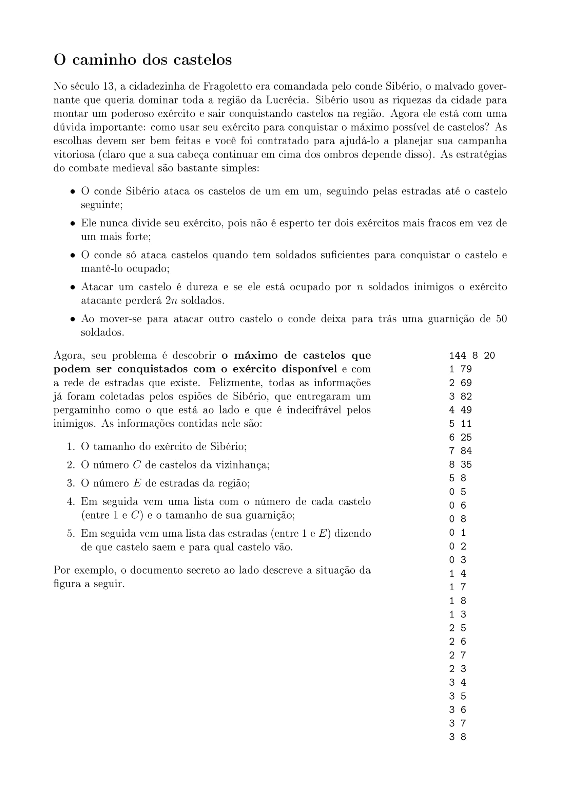
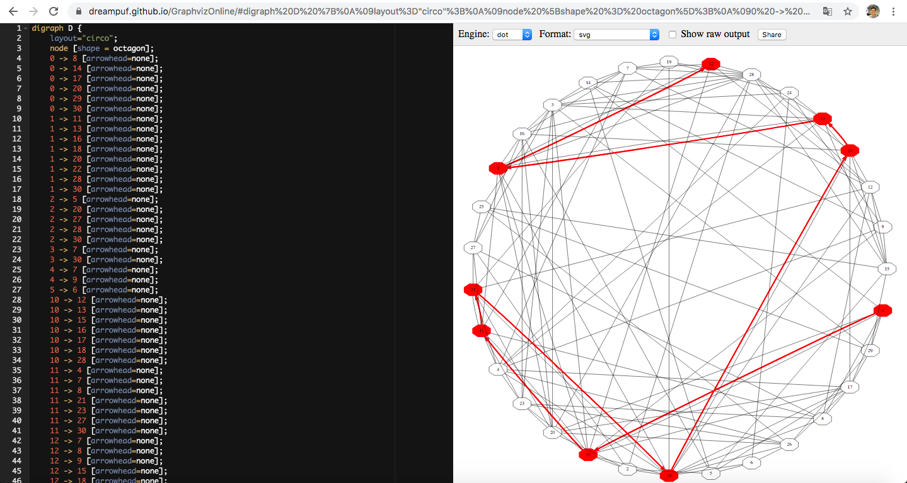

# graphgenerator-java
Esse repositório contém um código feito em java para solucionar um problema de caminhamento em grafos.

## Enunciado



## Como utilizar
#### Como são criados os exemplos?
O código possui uma pasta ```/casos``` com os arquivos txt que deverão ser consumidos para obter as informações sobre cada castelo. Ou seja, caso deseje criar uma nova simulação basta criar um novo txt com novos inputs.
#### Como rodar o programa?
O código possui dois arquivos ```SingleTest``` e ```MultipleTest``` que executarão toda a lógica. O ```SingleTest``` roda apenas um caso de teste selecionado e o ```MultipleTest``` suporta rodar todos os casos de uma só vez.

## Considerações Importantes
1 - Os casos de teste ```caso50.txt``` e ```caso60.txt```, que já estão no repositório, demoram consideravelmente para executar.
2 - Depois de executado o programa, será criada uma pasta ```/Graph``` com arquivos .gv de cada caso de teste. Para gerar o desenho do grafo percorrido basta acessar o [link](https://dreampuf.github.io/GraphvizOnline/) e colar todo arquivo .gv ali na caixa de texto que é gerado o grafo em tempo real. Exemplo:



## Criado por
* Pedro Portella Possamai
